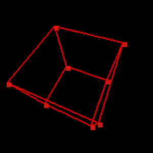

# Projeto: a projeção 3D de um cubo

Neste projeto, implementaremos a projeção de um mundo 3D em uma tela 2D usando o algoritmo da pinhole camera. 

O objetivo deste projeto é fazer uma projeção em tempo real de um cubo em *wireframe* que gira em todas as direções, chegando em algo do tipo:

Neste projeto, é *obrigatório* usar a biblioteca `pygame`, a exemplo do que temos visto. Para desenhar linhas na tela, deve ser usada a função `pygame.draw.line` ou equivalente. Todas as transformações devem ser implementadas manualmente, pelo próprio grupo (uma vez que o objetivo do projeto é examente implementar essas transformações). Não é permitido usar bibliotecas adicionais (OpenGL, funções de câmera do próprio `pygame`, etc.) que resolvam as transformações aplicadas automaticamente. Em resumo: só é permitido usar bibliotecas para resolver os gráficos em 2D, e todas as manipulações em 3D devem ser realizadas por transformações implementadas em `numpy` pelo próprio grupo.

## Algumas anotações teóricas

### Projeções 3D

Uma projeção de 3D para 2D funciona de uma maneira muito parecida com a projeção de 2D para 1D que fizemos na aula. Uma boa ideia é imaginar um mundo 3D com dimensões X, Y, Z, de tal forma que o *pinhole* fica no ponto $[0,0,0]$ e o anteparo fica no plano $z=-d$, com $d$ definido pelo grupo (na aula, tínhamos usado $d=1$, mas isso não é obrigatório). Assim, da mesma maneira que tínhamos colocado o anteparo no ponto $x=-d$ na projeção 2D, agora colocamos o anteparo no plano $z=-d$. Com isso, conseguimos utilizar o mesmo método para calcular separadamente as projeções de $x$ e de $y$.

$$
\begin{bmatrix}
z_p \\
x_{p}w_{p} \\
w_p \\
\end{bmatrix}= 
\begin{bmatrix}
0 & 0 & -d \\
1 & 0 & 0 \\
0 & -\frac{1}{d} & 0 \\
\end{bmatrix}
\begin{bmatrix}
x_o \\
z_o \\
1 \\
\end{bmatrix}
$$

$$
\begin{bmatrix}
z_p \\
y_{p}w_{p} \\
w_p \\
\end{bmatrix}= 
\begin{bmatrix}
0 & 0 & -d \\
1 & 0 & 0 \\
0 & -\frac{1}{d} & 0 \\
\end{bmatrix}
\begin{bmatrix}
y_o \\
z_o \\
1 \\
\end{bmatrix}
$$

Para evitar de calcularmos $w_p$ e $z_p$ duas vezes, podemos usar uma matriz $P$ para calcular $z_p$, $w_p$, $x_pw_p$ e $y_pw_p$ de uma vez, e então calcular $y_p$ e $x_p$ usando esses valores.

### Como modelar e posicionar um cubo

Lembre-se que um cubo tem 8 vértices. Se forem colocados num espaço 3D, como eles ficam? Também, entre quais vértices nós devemos desenhar arestas?

Quais são as matrizes que permitem partir dos vértices na posição que você decidir desenhar e levar o cubo para o campo de visão da sua câmera?

### O espaço de pixels

Na tela, a posição $[0,0]$ não corresponde ao meio da tela, e sim ao canto superior esquerdo. Então, após fazer a projeção, é possível que seja necessário fazer uma etapa de translação adicional!

### Rotações em direções arbitrárias

Em 3D, é possível rotacionar pontos ao redor de cada um dos eixos usando as matrizes:

$$
R_x = \begin{bmatrix}
1 & 0 & 0 & 0 \\
0 & \cos(\theta) & -\sin(\theta) & 0 \\
0 & \sin(\theta) & \cos(\theta) & 0 \\
0 & 0 & 0 & 1
\end{bmatrix}
\hspace{0.5in}
R_y = \begin{bmatrix}
\cos(\theta) & 0 & \sin(\theta) & 0 \\
0 & 1 & 0 & 0 \\
-\sin(\theta) & 0 & \cos(\theta) & 0 \\
0 & 0 & 0 & 1
\end{bmatrix}
\hspace{0.5in}
R_z = \begin{bmatrix}
\cos(\theta) & - \sin(\theta) & 0 & 0 \\
\sin(\theta) & \cos(\theta) & 0 & 0 \\
0 & 0 & 1 & 0 \\
0 & 0 & 0 & 1
\end{bmatrix}
$$

Essas matrizes já contém a nossa (necessária) dimensão adicional que permitirá, depois, controlar as translações e projeções.

**ENTREGAS**
* Link para o repositório onde está o programa.
* No `README.md` do repositório, inclua uma descrição de como executar o programa, como usá-lo, etc.
* Um relatório, em vídeo ou PDF, explicando como funciona a matemática que foi usada em cada uma das etapas.

**RUBRICA**

O projeto será avaliado usando a rubrica abaixo. Os níveis são cumulativos, isto é, para passar de um nível, *todos* os requisitos dele devem ser cumpridos. 

| Nível | Descrição |
| --- | --- |
| F | Não tem pip install, não tem documentação de usuário, não mostra cubo na tela em Pygame, não usa explicitamente o modelamento 3D que discutimos para fazer a projeção 
| D | Todo o nível F foi contemplado, mas só alguns ítens de C foram contemplados
| C | Cubo rotaciona automaticamente. Relatório explica completamente como o sistema funciona.
| B | Todos os ítens de C foram contemplados, mas o nível A está incompleto. 
| A | O grupo realizou ao menos duas das opções abaixo, incluindo a implementação e a adição de como funciona no relatório: (1) Usou outras formas que não são um cubo; (2) Controla a rotação pelo teclado; (3) Permite caminhar (translação) ao longo do mundo 3D.