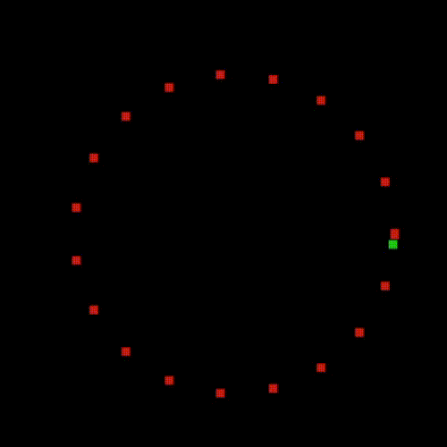
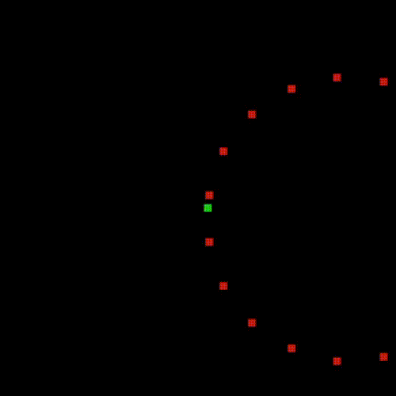
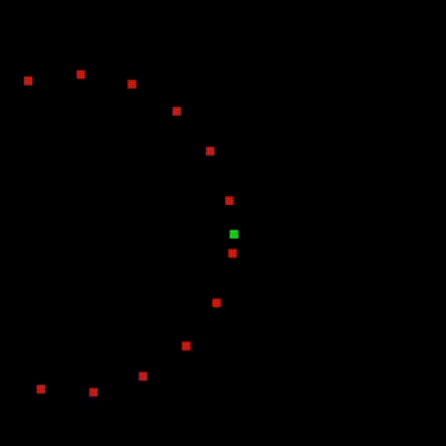

# Projeto: referencial do jogo

**Objetivo: realizar uma mudança de referencial em tempo real**

Em algumas situações, como jogos digitais, gostaríamos de mudar o referencial sobre o qual estamos visualizando. Um exemplo disso é um jogo em primeira pessoa: embora o personagem, em relação ao mundo, possa caminhar por um espaço qualquer, toda a visão que o jogador tem é de acordo com o referencial do próprio personagem.

Neste exercício, vamos partir do pequeno jogo abaixo. Ao executar o código, você deve ver um personagem verde girando no meio de vários pontos vermelhos. 



Veja no código que o jogador é representado pela variável `s` e os pontos ao seu redor são representados no vetor `pontos_loc`.

```python
import pygame
import numpy as np
pygame.init()

# Tenho aqui vários pontos sobre uma circunferência
angulo = np.linspace(0, 2*np.pi, 20)
pontos_loc = np.vstack ( (100*np.cos(angulo)+200, 100*np.sin(angulo)+200, np.ones(20)) )

# Controle de tempo
t = 0

# Velocidade angular (rotacoes por segundo)
v = 0.2

# Tamanho da tela e definição do FPS
screen = pygame.display.set_mode((400, 400))
clock = pygame.time.Clock()
FPS = 60  # Frames per Second

BLACK = (0, 0, 0)
COR_PERSONAGEM = (30, 200, 20)
COR_PONTOS = (200, 30, 20)

# Personagem
personagem = pygame.Surface((5, 5))  # Tamanho do personagem
personagem.fill(COR_PERSONAGEM)  # Cor do personagem

# Pontos 
pontos = pygame.Surface((5, 5))
pontos.fill(COR_PONTOS)  # Cor dos pontos

rodando = True
while rodando:
    # Capturar eventos
    for event in pygame.event.get():
        if event.type == pygame.QUIT:
            rodando = False

    # Controlar frame rate
    clock.tick(FPS)

    # Movimento do personagem
    t += 1/FPS
    theta = v*t
    s = np.array([[200],[200]]) + 100 * np.array([ [np.cos(2*np.pi*theta)], [-np.sin(2*np.pi*theta)]])
    s = np.vstack( (s, np.ones(1)))

    # Desenhar fundo
    screen.fill(BLACK)

    # Dica: use pontos_loc_y para receber o resultado das transformações feitas sobre pontos_loc
    pontos_loc_y = pontos_loc

    # Desenhar pontos
    for p in range(pontos_loc.shape[1]):
        rect = pygame.Rect(pontos_loc_y[0:2,p], (2, 2))  # First tuple is position, second is size.
        screen.blit(pontos, rect)
        
    # Desenhar personagem
    rect = pygame.Rect((s)[0:2,0], (10, 10))  # First tuple is position, second is size.
    screen.blit(personagem, rect)

    # Update!
    pygame.display.update()

# Terminar tela
pygame.quit()
```

Veja que a posição do jogador está no vetor `s`, que é recalculado a cada iteração do jogo.

Gostaríamos de manter nosso jogador sempre no centro da tela, mas gostaríamos de usar somente *multiplicações matriciais* para isso.

1. Através de uma nova matriz $T$ (crie essa matriz!), transforme os pontos do vetor `pontos_loc` e do próprio vetor `s` de forma que a tela fique sempre centralizada no jogador. Seu resultado deveria ser um ponto verde parado na tela e vários pontos vermelhos girando ao redor dele. Lembre-se que o ponto central da tela é o ponto $(200,200)$ O resultado deve ser parecido com isso:



2. Após, gostaríamos de manter a "frente" do jogador sempre virada para cima, isto é, vamos fazer uma transformação para que todos os pontos do mundo virtual girem em torno do nosso personagem. O resultado deve ser algo parecido com:



!!! info "Lembre-se!"
    Uma matriz de *translação* se parece com:

    $$
    T = \begin{bmatrix}
    1 & 0 & \Delta x \\
    0 & 1 & \Delta y \\
    0 & 0 & 1 
    \end{bmatrix}
    $$

    Uma matriz de *rotação*, que realiza a rotação de vetores *ao redor da origem*, se parece com:
    $$
    T = \begin{bmatrix}
    \cos(\theta) & -\sin(\theta) & 0 \\
    \sin(\theta) & \cos(\theta) & 0 \\
    0 & 0 & 1 
    \end{bmatrix}
    $$
